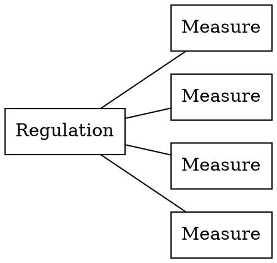

# Tariff Data Manual

### How to add images:
1. Go to issues and click 'new issue' 
2. Paste your image into the text box
3. A URL will be generated 
4. Copy and Paste this URL into your page

### How to add tables:
1. visit this website: https://www.tablesgenerator.com/markdown_tables# 
2. Go to file > paste table data > load > generate > copy to clipboard 
3. You can put line breaks in your table as `<br>`

### How to underline text:
Use this format: `<ins>text</ins>`

### How to add graphs: 

**Graph 1:** 
1. This graph looks like this: 


2. You can add a graph like this by adding a block of [Database Markup Language (DBML)](https://www.dbml.org):

````
```dbml
Table "Measure Type" {
    measure_type_id int [pk]
    validity_start_date date
    validity_end_date date
}

Table Measures {
    measure_sid int [pk]
    measure_type_id int [fk]
    "..." ...  // Put dots in quotes for column names
}

Table "Measure Type Description" {
    measure_type_id int [fk]
    language_id char(2)
    description char(500)
}

Ref: Measures.measure_type_id > "Measure Type".measure_type_id
Ref: "Measure Type Description".measure_type_id > "Measure Type".measure_type_id
```
````

**Graph 2:** 
1. This graph looks like this: 


2. You can add a graph like this by using the following format: 

````

````

### A few things that we need to consider:
- We need to put a 'back to the top' button at the end of each page 
- We need to add a 'Is there anything wrong with this page?' section at the end of each page so if users notice any mistakes/problems they can notify us
- Although we can add tables, there are still a few formatting kinks that need to be straightend out such as how to highlight rows/columns/cells or how to merge cells

## Running the documentation locally

Requires:

* graphviz
* node
* ruby 2.6.0

Install the submodule:

```
cd wiki
git submodule init
git submodule update
```

Install dependencies:

```
bundle install
```

Build:

```
rake build
```

Run the server:

```
bundle exec middleman server
```

Access the site at localhost:4567